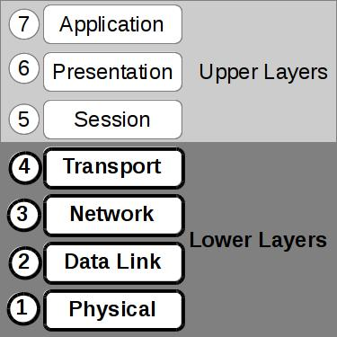
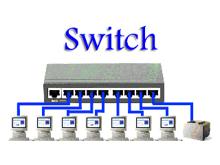

Lesson 9: Networking
====================

Who is this talk for?
---------------------

Someone with little or no networking knowledge.

ECE/CS 372 at OSU covers this content, more or less

What is a network?
------------------

"*a group or system of interconnected people or things*"

To us, a network is:

* Electronic devices
* Sending signals over wire, fiber, or radio
* Communicating data using a standardized protocol

What is a protocol?
-------------------

"*A set of agreed upon rules for communication*"

* Defines sequence & format of packets being sent

The OSI Model
-------------

Open Systems Interconnection

* Layers of abstraction

.. note:: "Create a layer of easily localized functions so that the layer
    could be totally redesigned and its protocols changed in a major way...
    without changing the services expected from and provided to adjacent
    layers"

Layer 1: Physical
-----------------

Networking Hardware

* Connector shapes
* Wire, optical fiber, or radio signal specifications

.. figure:: static/cat5.jpg
    :align: center

RS-232

.. figure:: static/db25.png
    :align: center

Layer 2: Data Link
------------------

MAC: Media Access Control

* MAC address should be globally unique
* ARP: Address Resolution Protocol (between layer 2 & 3)
* NDP (neighbor discovery protocol) used in IPv6
* Flow control & error checking

Layer 3: Network
----------------

Packet forwarding and routing

Network and host addressing

* IPv4
* IPv6

Layer 4: Transport
------------------

Interact directly with program same-order delivery, reliability, flow control,
and congestion avoidance

:TCP: Transmission Control Protocol

* used by HTTP, HTTPS, SMTP, POP3, IMAP, SSH, FTP, Telnet

:UDP: User Datagram Protocol

* No error checking built in
* No retransmission delays
* VoIP, media, games

Get your hands dirty
--------------------

In a linux terminal run:::

  ip a

These will display information about your network interfaces.

See also::

  ifconfig
  iwconfig

Example output:
---------------

::

    user@host:~$ ip a
    ...
    2: eth2: <NO-CARRIER,BROADCAST,MULTICAST,UP> mtu 1500 qdisc pfifo_fast state DOWN qlen 1000
        link/ether 33:77:00:44:66:33 brd ff:ff:ff:ff:ff:ff
    3: wlan1: <BROADCAST,MULTICAST,UP,LOWER_UP> mtu 1500 qdisc mq state UP qlen 1000
        link/ether 24:77:33:44:55:66 brd ff:ff:ff:ff:ff:ff
        inet 192.168.1.55/24 brd 192.168.1.255 scope global wlan1
        inet6 fe80::2677:3ff:fed4:538c/64 scope link 
           valid_lft forever preferred_lft forever

Netmask:
--------

====================    ====================================
Decimal IP Address          Binary IP Address          
--------------------    ------------------------------------
192.168.1.55             11000000.10101000.00000001.00110111
255.255.255.0            11111111.11111111.11111111.00000000
====================    ====================================

=======================    ===================================
Part of address            Corresponding address
-----------------------    -----------------------------------
Network (Decimal)          192.168.1.0                
Network (Binary)           11000000.10101000.00000001.00000000
Host (Decimal)             0.0.0.55
Host (Binary)              00000000.00000000.00000000.00110111
=======================    ===================================

Available Hosts:   192.168.1.[1-254]

Broadcast address: 192.168.1.255

Netmask Example:
----------------

====================    ====================================
Decimal IP Address          Binary IP Address          
--------------------    ------------------------------------
192.168.90.55            
255.255.192.0            
====================    ====================================

Netmask Example:
----------------

====================    ====================================
Decimal IP Address          Binary IP Address          
--------------------    ------------------------------------
192.168.90.55            11000000.10101000.01011010.00110111
255.255.192.0            11111111.11111111.11000000.00000000
====================    ====================================

=======================    ===================================
Part of address            Corresponding address
-----------------------    -----------------------------------
Network (Decimal)          192.168.64.0                
Network (Binary)           
Host (Decimal)             0.0.26.55
Host (Binary)              
=======================    ===================================

Netmask Example:
----------------

====================    ====================================
Decimal IP Address          Binary IP Address          
--------------------    ------------------------------------
192.168.90.55            11000000.10101000.01011010.00110111
255.255.192.0            11111111.11111111.11000000.00000000
====================    ====================================

=======================    ===================================
Part of address            Corresponding address
-----------------------    -----------------------------------
Network (Decimal)          192.168.64.0                
Network (Binary)           11000000.10101000.01000000.00000000
Host (Decimal)             0.0.26.55
Host (Binary)              00000000.00000000.00011010.00110111
=======================    ===================================

Available Hosts:   192.168.[64-127].[1-254]

Broadcast Address: 192.168.127.255

Routes
------

:: 

    user@host:~$ route
    Kernal IP routing table
    Destination     Gateway         Genmask         Flags Metric Ref    Use Iface
    default         foo.osuosl      0.0.0.0         UG    0      0        0 wlan1
    link-local      *               255.255.0.0     U     1000   0        0 wlan1
    192.168.1.0     *               255.255.255.0   U     2      0        0 wlan1

::

    user@host:~$ route -n
    Kernel IP routing table
    Destination     Gateway         Genmask         Flags Metric Ref    Use Iface
    0.0.0.0         192.168.1.1     0.0.0.0         UG    0      0        0 wlan1
    169.254.0.0     0.0.0.0         255.255.0.0     U     1000   0        0 wlan1
    192.168.1.0     0.0.0.0         255.255.255.0   U     2      0        0 wlan1

Bootstrapping
--------------

What happens when your computer connects to a network?

1. Duplex and speed negotiation
2. Static or dynamic configuration is applied

Static Configuration
--------------------

Must in advance know:

* IP Address
* Netmask
* Default Gateway
* DNS Servers (optional in some cases)

Dynamic Configuration
---------------------

All of the statically defined parameters are retrieved over the network via DHCP

But how do you communicate over the network without a network configuration?

Reserved IPv4 Addresses
-----------------------

* 127.0.0.1

.. figure:: static/noplacelike_home.jpg
    :align: right

* 192.168.0.0
* 172.16.0.0
* 10.0.0.0
* 169.254.0.0

Public vs Private Address
-------------------------

:NAT: Network Address Translation

* lose end-to-end traceability
* hides internal network topology
* allows use of private IP's over public internet
* conserves limited public IP's

Network Devices
---------------

.. figure:: static/router.jpg
    :align: center

.. figure:: static/switch.jpg
    :align: center
    :scale: 70%

Network Devices
---------------

.. figure:: static/router1.jpg
    :align: center

Control Layer
-------------

Connection oriented vs Connectionless

Collisions
----------

CSMA CA
  All Wireless networks use this Carrier Sense Multiple Access with Collisions
  Avoidance

CSMA CD
  Carrier Sense Multiple Access with Collisions Detection

Why is this important?

http://articles.latimes.com/2007/aug/15/local/me-lax15
