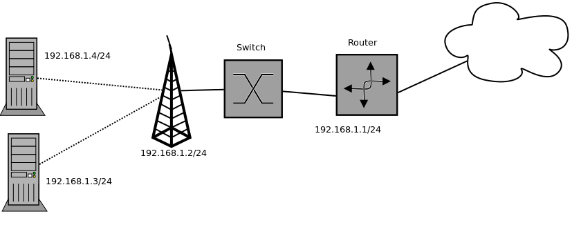
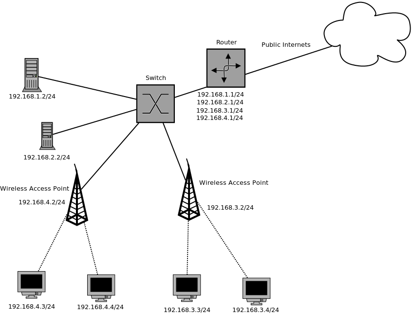

Lesson 10: Networking part 2
============================

Agenda
------

* Networking review
* DNS
* Web Server Setup

Networking Review
-----------------

.. figure:: static/Home.png

Networking Review
-----------------

Networking Review
-----------------

.. figure:: static/Home2.png

Networking Review
-----------------

.. figure:: static/Home3.png

Networking Review
-----------------

Intro to DNS
------------

|

.. figure:: static/visit_osuosl.org.png
    :align: center

I get the OSL's home page when visiting osuosl.org

How do I know where the page came from?
---------------------------------------

::

    HOST(1)                       BIND9                       HOST(1)

    NAME
           host - DNS lookup utility

    SYNOPSIS
           host [-aCdlnrsTwv] [-c class] [-N ndots] [-R number]
                [-t type] [-W wait] [-m flag] [-4] [-6] {name}
                [server]

    DESCRIPTION
           host is a simple utility for performing DNS lookups. It is
           normally used to convert names to IP addresses and vice
           versa. When no arguments or options are given, host prints
           a short summary of its command line arguments and options.

OSL
---

.. code-block:: bash

    $ host osuosl.org
    osuosl.org has address 140.211.15.183

How did it know?

DNS
---

Domain Name System

.. figure:: static/phonebook_wikipedia.jpg
    :align: center
    :scale: 80%

* Port 53

My laptop asked a DNS server how to get to osuosl.org.

Hierarchy of domains
--------------------

|

.. figure:: static/tree.png
    :align: center

Pop quiz
--------

.. rst-class:: build

- What's 15 * 823?

- 12345

Recursive DNS
-------------

.. figure:: static/An_example_of_theoretical_DNS_recursion_wikimedia.png
    :align: center
    :scale: 75%

* Always gives real answer or error
* Vulnerable to cache poisoning

Non-recursive
-------------

* Uses cache or referral
* Includes all authoritative-only
    * root and top-level domain servers

Another Quiz
------------

.. rst-class:: build

- What's 15 * 823?

- How did you know so quickly?

Caching
-------

- You cached the answer.
- DNS can be cached at routers, ISPs, and DNS servers to improve performance.

    - Negative caching: Remember fails
- TTL

/etc/resolv.conf
----------------

Configuration for BIND (Berkeley Internet Name Domain tool)
    * most common DNS resolver
    * current version is BIND 9

.. code-block:: bash

    $ cat /etc/resolv.conf 
    # Generated by resolvconf
    domain wireless.oregonstate.edu
    nameserver 128.193.15.13
    nameserver 128.193.15.12

Can only handle recursive name servers, no referrals

/etc/hosts
----------

Used to skip looking up the DNS

Useful for testing web sites

`Avoid malicious sites <http://someonewhocares.org/hosts/>`_

.. code-block:: bash

    $ cat /etc/hosts
    127.0.0.1 devops-bootcamp32.osuosl.org devops-bootcamp32 localhost
    localhost.localdomain localhost4 localhost4.localdomain4
    ::1       localhost localhost.localdomain localhost6 localhost6.localdomain6

Load Balancing
--------------

Multiple IPs bound to a single hostname are returned in random order

.. code-block:: bash

    $ host google.com
    google.com has address 173.194.33.131
    google.com has address 173.194.33.132
    google.com has address 173.194.33.133
    google.com has address 173.194.33.134
    google.com has address 173.194.33.135
    google.com has address 173.194.33.136
    google.com has address 173.194.33.137
    google.com has address 173.194.33.142
    google.com has address 173.194.33.128
    google.com has address 173.194.33.129
    google.com has address 173.194.33.130

Records
-------

.. note:: `rfc 1035 <http://tools.ietf.org/html/rfc1035>`_

:A: hostname -> IPV4 address
:AAAA: hostname -> IPV6 address
:CNAME: like an alias, "Go look up this name's record"
:PTR:
    * Pointer to a canonical name, returns name and stops
    * Used in reverse DNS
:SOA:
    * Start of Authority for a zone (such as osuosl.org) 
    * Administrator contact info, timers, serial number
:MX: Email (more on this next week)

Reverse DNS
-----------

.. note:: http://support.simpledns.com/kb/a45/what-is-reverse-dns-and-do-i-need-it.aspx

Reverse segments, then end with in-addr.arpa

.. code-block:: bash

    $ host osuosl.org   # could also use dig
    osuosl.org has address 140.211.15.183

.. code-block:: bash

    $ dig 183.15.211.140.in-addr.arpa
    ...
    ;; AUTHORITY SECTION:
    15.211.140.in-addr.arpa. 10795  IN  SOA ns1.auth.osuosl.org. hostmaster.osuosl.org. 1398356710 300 900 604800 86400

Web Apps: A Bit of Review
-------------------------

- We created a python app called Systemview using the Flask framework
- We tested Systemview by running Flask's built-in webserver on the command line
- Systemview ran on a special port we had to open up on the virtual machine

What We Want To Do
------------------

- Install a production-quality web server on a standard port
- Serve Systemview using that web server
- Party

Why?
----

* Flask's web server is not robust or secure
* We want to use standard ports for our web apps
* We may want to run multiple apps on one server
* Web server administration is *cool*
  

What is a Web Server
--------------------

.. figure:: static/web_app_diagram-server-highlight.png
    :align: center
    :scale: 100%

.. note:: Webserver software, not hardware

Webservers Talk HTTP
--------------------

They don't run code (well, they kinda do)

- PHP, Python, Ruby, C don't run in your browser
- Separate servers (usually) run that code, and send the output of the code to
  the web server to send to your browser
- Sometimes those separate servers are web server modules

.. note:: Apache modules generally run in the apache process itself

A Digression: AJAX, JSON and APIs 
---------------------------------

* Browsers render HTML/CSS (layout)
* Browsers execute Javascipt (logic)
* Javascript can dynamically update the layout
* Javascript can handle user interaction
* Javascript can call back to the server for more data
* Javascript can process data
* **Javascript is Client Side Logic**

AJAX
----

* **A**\ synchronous **J**\ avascript **A**\ nd **X**\ ML
* An http request initiated by Javascript
* Javascript listens in the background
* The app sends a response containing data
* Javascript processes the data
* Traditionally XML, but now mostly JSON
  
.. note::
  Lots of issues around security, javascript calling many servers, gathering
  data, calling servers outside the domain of the originating page, etc. Install
  RequestPolicy and NoScript, just to see who that web page is talking to while
  you read it.

JSON
----

**J**\ ava\ **S**\ cript **O**\ bject **N**\ otation

.. code-block:: json

    {"menu": {
      "id": "file",
      "value": "File",
      "popup": {
        "menuitem": [
          {"value": "New", "onclick": "CreateNewDoc()"},
          {"value": "Open", "onclick": "OpenDoc()"},
          {"value": "Close", "onclick": "CloseDoc()"}
        ]
      }
    }}

XML
---

The same text expressed as XML:

.. code-block:: xml

    <menu id="file" value="File">
      <popup>
        <menuitem value="New" onclick="CreateNewDoc()" />
        <menuitem value="Open" onclick="OpenDoc()" />
        <menuitem value="Close" onclick="CloseDoc()" />
      </popup>
    </menu>

APIs
----

* When web apps talk to web apps
* When javascript talks to a web app
* When curl talks to a web app

They talk HTTP, using clearly defined GET or POST params to initiate actions on
the remote application.

::

    curl http://graph.facebook.com/12345/friendlists
    curl https://api.github.com/users/osuosl/repos
    curl http://pub.sandbox.orcid.org/v1.1/0000-0001-7857-2795/orcid-bio

.. note::
  Take a look at the source of a web page, look at all the javascript! How much
  of it is talking to Google, to Facebook, etc?

Let's Install a Web Server!
---------------------------

::

    yum install httpd

Apache
------

What's this httpd thing?

"*A patchy web server*" - born of many patches to NCSA's HTTPD (1995)

* Venerable, tested, solid
* Old, complex, slow (not really that slow)
* Many modules for executing code
* Many modules for all kinds of other things too
  
Let's Serve Some Web
--------------------

Apache's ``DocumentRoot`` is the default place where it will look for files to
serve. It maps "/" in the URL to a location on disk

.. code-block:: bash

    http://localhost:8080/index.html
                         ^
                         "/" is the DocumentRoot

We'll write some HTML in the ``DocumentRoot`` for Apache to serve.

But First, Config Files
-----------------------

::

    /etc/httpd/conf/httpd.conf

.. code-block:: apache

    DocumentRoot "/var/www/html"

    <Directory "/var/www/html">
        Options Indexes FollowSymLinks
        AllowOverride None
        Order allow,deny
        Allow from all
    </Directory>

.. note::
  Just looking, we are not editing the configs here. Note the ``DocumentRoot``
  and Directory 

Wait, What am I Writing Again?
------------------------------

**HTML**: **H**\ yper **T**\ ext **M**\ arkup **L**\ anguage

Go to the ``DocumentRoot`` and create an html file:

.. code-block:: bash

    cd /var/www/html
    vim index.html

.. code-block:: html

    <html>
        <head>
            <title>This is only a test!</title>
        </head>
        <body>
            
Nothing to see here, move along

        </body>
    </html>

Point your browser to: http://localhost:8080/index.html

.. note::
  HTML, is it code? Is it a language? Can you do logic with it? What happens if
  you forget the ``<html>``? The browser does the rendering, the web server
  doesn't care, it just sends the data along. HTTP ``Content-Type`` header says
  what kind of data.

Voila!
------

* Apache receives a request for /index.html
* It translates "/" into ``/var/www/html`` using the ``DocumentRoot`` directive
* It looks in ``/var/www/html`` for the file "``index.html``"
* It finds your file and sends its contents, along with HTTP headers, back to
  your browser

.. note::
  Have a look at the page source. Edit the file, remove <html>, etc, look at
  source again. If time allows, use developer tools, firebug, etc to look at
  http headers

But I Want to Run Code!
-----------------------

Let's put some PHP code in the ``DocumentRoot``:

::

    vim index.php

.. code-block:: html

    <html>
        <head>
            <title>This is only a test!</title>
        </head>
        <body>
            <?php print "Hey, this is PHP!" ?>
        </body>
    </html>

Then go to  http://localhost:8080/index.php

What Went Wrong?
----------------

Apache doesn't know what PHP is, it needs a module to execute the PHP code and
return data it can serve

::

    yum install php
    service httpd restart

.. note::
  Pop quiz - where do you look to find out what went wrong? Look at log files,
  talk about them, then look at page source.

Voila, Again.
-------------

How does Apache know what to do with index.php?

::

    /etc/httpd/conf.d/php.conf

.. code-block:: apache

    <IfModule prefork.c>
      LoadModule php5_module modules/libphp5.so
    </IfModule>
    <IfModule worker.c>
      LoadModule php5_module modules/libphp5-zts.so
    </IfModule>

    AddHandler php5-script .php
    AddType text/html .php

    DirectoryIndex index.php

.. note::
  CentOS, and most distribution system packages put these conf files for modules
  in place for you. httpd.conf includes everything in conf.d - similar for Nginx

Ok, But I Want To Serve a Python App...
---------------------------------------

There's a module for that! (Actually several, but we are going to use this one)

**WSGI**:  **W**\ eb  **S**\ erver  **G**\ ateway  **I**\ nterface

* Standardized interface for python apps to talk to web servers
* Works with many different servers
* Allows separation of python app and web server processes
  
.. note::
  talk about mod_python - runs python scripts directly, not bad for single
  scripts, but unwieldy for applications and frameworks.

Sounds Great, Let's Go!
-----------------------

::

    yum install mod_wsgi

Let's clone the systemview app into a reasonable location while we are at it

.. code-block:: bash

    cd /var/www
    git clone https://github.com/DevOpsBootcamp/systemview.git
    cd systemview
    git checkout wsgi

.. note::
  Talk about the location - can be anywhere, but be consistent - /var/www is
  actually not in the web root, not accessible by default, don't put things
  under the docroot!

Don't Forget Virtualenv!
------------------------

(in the systemview/ directory)

.. code-block:: bash
    
    virtualenv --no-site-packages venv
    source venv/bin/activate
    pip install -r requirements.txt

And lets make sure everything is owned by the web server:

.. code-block:: bash
    
    chown -R apache ../systemview

.. note::
  Web server user/group ownership is a major source of breakage - get
  cloning/pulling as the wrong user will change perms on files, possibly
  breaking things

What Makes an App WSGI?
-----------------------

::
    
    systemview.wsgi

.. code-block:: python

    activate_this = '/var/www/html/systemview/venv/bin/activate_this.py'
    execfile(activate_this, dict(__file__=activate_this))

    import sys
    sys.path.insert(0, '/var/www/html/systemview')

    from systemview import app as application

Configuring Apache for Systemview
---------------------------------

::

    /etc/httpd/conf.d/systemview.conf

.. code-block:: apache

    WSGISocketPrefix /var/run
    WSGIDaemonProcess systemview user=apache group=apache threads=5
    WSGIScriptAlias /systemview /var/www/systemview/systemview.wsgi

    <Directory /var/www/systemview>
            WSGIProcessGroup systemview
            WSGIApplicationGroup %{GLOBAL}
            Order deny,allow
            Allow from all
    </Directory>

(Look for this in systemview/docs/systemview.conf)

.. note:: This will go into a vhost some day

Even More Voila
---------------

http://localhost:8080/systemview

There are a lot of steps to getting this app up, wouldn't it be nice to automate
this?

.. note::
  Future topics - configuration management and automated deploys, virtual hosts,
  best practices for app location, Nginx, UWSGI, PHP-FPM, etc

Homework
--------

* Deploy Systemview's master branch with Apache (we merged the database code)
* Read about Apache Virtualhosts
* Install Nginx and UWSGI, deploy Systemview
