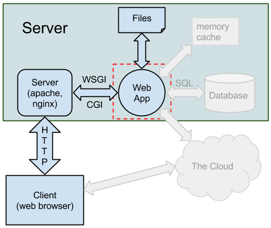
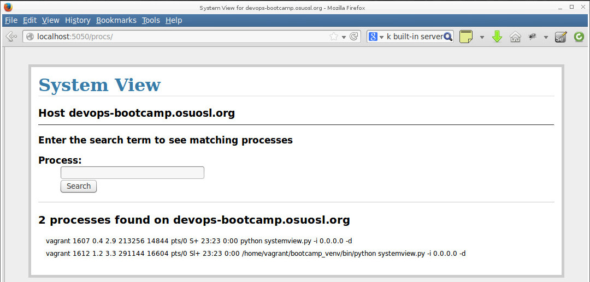

==========================
Lesson 5: Web Applications
==========================

What is a web app?
==================

.. note:: talk breifly about responsibilities of each component
    talk briefly about http
    mention Virtual Environments (red box on diagram)

What is this Virtual Environment thing?
---------------------------------------

.. note:: Discuss system packages vs local, mention rvm

* Separates application packages from system packages
* Install modules as a user
* Choose versions that differ from the system versions
* Maintain a list of required packages for easy install
* Pip and Gem

Frameworks
----------

Ready-made building blocks take care of the tedious details:

* Speaking HTTP
* Connecting code to URLS
* Talking to the database
* Built-in development servers
  
Popular frameworks:

Django, CakePHP, Ruby on Rails, Flask

.. note:: Talk about major differences between frameworks, especially
	Django and Flask

The SystemView app
==================

Display a list of processes on the system matching a search term

.. note:: explain basic idea of the app
	reference code from lesson 4

Setting Up
----------

Update your vagrant file and vagrant up:

.. code-block:: bash

	git pull
	vagrant up
	vagrant ssh

.. note:: Changes to the vagrant file: forward port 5050 to 5000 on the vm

    
Setting Up
----------

Install packages

.. code-block:: bash

	sudo yum update
	sudo yum install python-virtualenv*
	sudo yum install git

Create a virtualenv

.. code-block:: bash

	virtualenv systemview_venv

And activate it

.. code-block:: bash

	source systemview_venv/bin/activate

.. note:: students probably already have git?
	discuss what virtualenve actually does, what is in it
	env variables, etc
	they can put the virtualenv anywhere, discuss locations
	discuss, but don't use virtualenv tools (mkvirtualenv, use, etc)
	explain what source does

Get the Code
------------

.. code-block:: bash

	git clone https://github.com/DevOpsBootcamp/systemview.git

Then run it:

.. code-block:: bash

	cd systemview
	python systemview.py 

Fail
----

Oops!

.. code-block:: bash

	Traceback (most recent call last):
	  File "systemview.py", line 2, in <module>
	    from flask import Flask, request, session, g, redirect, url_for, \
	ImportError: No module named flask

.. note:: talk about missing modules, we need to install them, this is
	what the venv is for

Pip
---

A package manager for Python packages

* Connects to PyPi, a vast repository of Python modules
* Resolves dependencies, installs prerequites
* Can install packages from a list in a file

Install What's Missing
----------------------

Make sure you are in your virtualenv, then:

.. code-block:: bash
	
	pip install flask
	pip install argparse

Run and Test!
-------------

.. code-block:: bash
	
	python systemsettings.py -i 0.0.0.0 -d

Now go to http://localhost:5050

.. note:: talk about flags - go to terminal after this slide
	and talk about the code:
	main module, templates, css, etc

Branch and Modify
-----------------

Create a branch for your changes

.. code-block:: bash

	git checkout -b my_name

When you have made changes and everything works, push it up

.. code-block:: bash

	git push origin my_name

.. note:: talk about branching vs forking, get everyone working
	on a new feature or bug, create github issues?

Homework
--------

Add a feature or fix a bug, push your changes up.

Github URL:

https://github.com/DevOpsBootcamp/systemview

Github issue tracker:

https://github.com/DevOpsBootcamp/systemview/issues