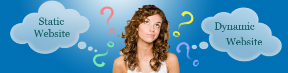

An Introduction to Web Frameworks
=================================

Static vs. Dynamic Websites
---------------------------

* We've covered the difference between static and dynamic things before. What's the difference between a static site and a dynamic site?

What is a Web Application Framework?
------------------------------------

* Framework: software providing generic functionality can be selectively changed by additional user-written code, thus providing application-specific software
* A web application framework provides many useful and universal functionalities so that you don't have to worry about them

.. figure:: 

Why use a WAF?
--------------

* It saves you a lot of writing and hassle
* You don't have to re-invent the wheel

Popular web frameworks
----------------------

Python:

1. Django: High-level web framework, lots of features.
2. Flask: Lightweight and easy to set up.

.. nextslide::

Ruby:

1. Rails:
2. Sinatra: Sinatra is to Ruby as Flask is to Python.

.. nextslide::

Node.js:

1. Express: Sweet, simple, relies heavily on third-party middleware to get the
   basics done.
2. Koa: Clean, small, and uses bleeding edge javascript features. Widely viewed
   as the successor to Express
3. Hapi: Web pages are configuration, not code.

.. nextslide::

Java:

1. Swing

PHP:

1. CakePHP

Model View Controller Architecture
----------------------------------

URL Routing
-----------

Object Relational Mappers (ORMs)
--------------------------------

Models
------

Who likes mad-libs?
-------------------

.. code-block:: text

	"_____________! he said ________ as he jumped into his convertible
	  exclamation            adverb
	______ and drove off with his __________ wife."
	 noun                          adjective

Templating Engines
------------------
* How does facebook put your username on the page? It renders a template,
  mad-libs style, with your name as a variable.
* Different frameworks typically have different templating engines.

.. nextslide::

Popular templating languages include:
* Flask's Jinja, very Django like, heavily uses filters for modifying
  variables.
* Embedded Ruby, a standard format for embedding arbitrary ruby into any file.
  Very PHP like. Can be used for other non-html files as well. Remember Chef
  templates?
* Jade, no html in sight.

Django Templates
----------------

Enter Migrations
----------------
* At some point you're probably going to wish you had a database backing your
  webapp.
* Sometimes you'll want to change the layout of the columns in the database.
  Maybe you have a new feature so you want to add a new column.
* However, if the database is running in production you can't just drop it and
  start over.
* Migrations move your data from the old database schema to the new one.
  Migrations can be 'rolled back', or undone like pressing Ctrl-Z.
* Every time you change a model, change the migrations.
