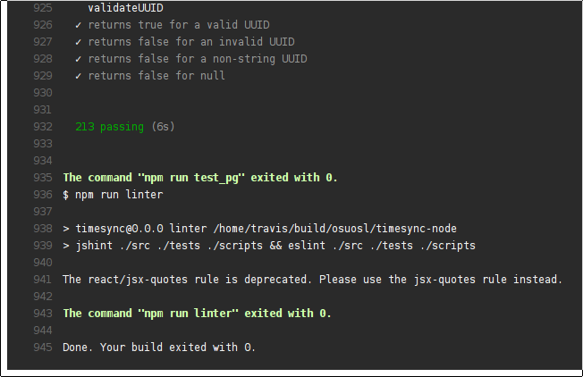

Spring Term Review
==================

Hello From Portland!
--------------------

As you are no doubt aware, we are giving this talk via Google Hangouts in
Portland. This week we are attending a conference on writing technical
documentation, a crucial skill you'll learn more about in Technical Writing
class, WR 327.

.. figure:: /static/portland.jpg
	:align: center
	:scale: 20%

What We Covered
---------------

* Configuration management
* Continuous integration
* Web application frameworks
* Testing and development
* Docker

Configuration Management
------------------------

Docker
------

Web Application Frameworks
--------------------------

Why should you use a web application framework?

* You don't have to re-invent the wheel.
* Web application frameworks have safeguards built in to prevent you from
  making security mistakes.

Popular web frameworks
----------------------

Python:

1. Django: High-level web framework, lots of features.
2. Flask: Lightweight and easy to set up.

.. figure:: static/flask.png
    :align: center

.. nextslide::

Ruby:

1. Rails:
2. Sinatra: Sinatra is to Ruby as Flask is to Python.

.. nextslide::

Node.js:

1. Express: Sweet, simple, relies heavily on third-party middleware to get the
   basics done.
2. Koa: Clean, small, and uses bleeding edge javascript features. Widely viewed
   as the successor to Express
3. Hapi: Web pages are configuration, not code.

Order now and for no extra charge you'll get:
---------------------------------------------

* An Object Relational Mapper, which is a way of chucking objects into a
  database and getting them back out.
* Migration tools to upgrade your database schema without losing data.
* Templating engines to play mad-libs with your web pages.

Testing and Development
-----------------------

Continuous Integration
----------------------

Development goes like this:

1. Write code & new tests.
2. Run tests.
3. If tests pass and you're ready to release, package your code.
4. ``goto 1``

.. nextslide::

However,

* Running tests is boring.
* Packaging code is boring.
* Let's have the robots do this for us.

.. figure:: /static/robot.png
	:align: right
	:scale: 15%

.. nextslide::

Some common continuous integration tools:

* Buildbot (Python)
* Travis CI
* Drone (Uses Docker!)
* Jenkins

Buildbot
--------

* If you need to compile a browser and test it on 12 operating systems, use
  this.
* Writing arbitrary python is great because it means your tests runner can do anything!
* Your test runners are horribly complex and can break in unforeseen ways.

.. figure:: ./static/buildbot.png
  :align: center
  :width: 70%

Travis CI
---------

* Just does tests, not packaging.
* Awesome Github integration.

Jenkins
-------

* Does anything you want.
* A big Web UI.

.. figure:: ./static/jenkins.png
  :align: center
  :width: 100%

Drone
-----

* Travis is nice, but it won't package my code for me, only builds on Ubuntu
  and only supports Github.
* Lets users pull down any old Docker image and build their code in there.

.. figure:: ./static/drone.png
  :align: center
  :width: 100%
