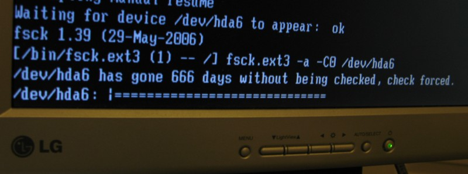

Lesson 6: Boot and the Filesystem Hierarchy
===========================================

.. note::
    - grub, filesystem stuff based roughly on Frostsnow's talk
    - basics of kernel and differences between virtualization/physical (the
      picture that kevin draws)

Before we begin
---------------

|

::

    $ sudo yum install man man-pages man-pages-overrides
    $ man hier # a massive man page explaining the filesystem hierarchy

::

    $ echo $PATH
    /usr/local/bin:/bin:/usr/bin:/usr/local/sbin:/usr/sbin:/sbin:\
    /home/vagrant/bin

``$PATH`` is used as a colon-delimited list of places to
look for binaries by your shell

::

    $ which pwd
    /bin/pwd

The ``which`` command tells you which binary it is running for a given name.

Before we begin
---------------

* File := Device in the context of a file system
* You can view a files information with any of the following commands::

    $ ls -l $file #
    $ file $file # will state long name of file type
    $ stat $file

Permission Bits
---------------

All files have 2 entry bytes and 12 permission bits:

* 2 entry bytes for type:

  * one of: regular, block, character, dir, link, fifo, socket, or whiteout

* 3 permission bits for user

  * read, write, execute

* 3 permission bits for group

  * read, write, execute

* 3 permission bits for everyone

  * read, write, execute

* 3 permission bits for special things:

  * sticky, setgid, setuid

Permission Bits
---------------

::

    ls -la /home
    drwxr-xr-x.  3 root    root    4096 Oct 29 16:06 .
    dr-xr-xr-x. 23 root    root    4096 Nov 13 20:21 ..
    drwx------.  3 vagrant vagrant 4096 Nov 13 21:53 vagrant

* First ten chars are permission bits, first ``-`` means regular file
* Every other ``-`` means either read, write, execute bit not set
* First three ``rwx`` is for user, then group, then other
* Change permissions with ``chmod``

Permissions (Octal)
-------------------

* 2 bytes for entry type

* 1 byte each for:

  * special, user, group, others

.. csv-table:: Permissions (Octal)
   :header: Category,Execute,Read,Write

   Special,1000 (sticky),2000 (setgid),4000 (setuid)
   User,0100,0200,0400
   Group,0010,0020,0040
   Other,0001,0002,0004

* Sum the 4 bytes to get total permissions, summing is bijective:

Permissions Example (Octal)
---------------------------

.. csv-table:: **1775**
   :header: Category,Execute,Read,Write

   Special,set (sticky), not set, not set
   User,set,set,set
   Group,set,set,set
   Other,set,not set,set

.. csv-table:: **0644**
   :header: Category,Execute,Read,Write

   Special,not set,not set,not set
   User,not set,set,set
   Group,not set,not set,set
   Other,not set,not set,set

The Linux Filesystem Hierarchy
------------------------------

|

.. note:: Based on Wade's talk
    https://github.com/clinew/presentation_filesystems/blob/master/presentation.tex

What's a filesystem?

    In computing, a file system is used to control how information is stored and
    retrieved. Without a file system, information placed in a storage area would
    be one large body of information with no way to tell where one piece of
    information stops and the next begins.

                       - (http://en.wikipedia.org/wiki/Filesystem)

Filesystem can mean:
--------------------

|

- **How the system's files are arranged on the disk**
- How the disk actually holds the files

  - FAT and NTFS are old but Windows-compatible
  - ext4 is standard, ext3 is older, xfs is being used less

    - journaling tracks changes before write

  - ZFS is awesome, but has meh Linux support (but getting better)
  - btrfs is similar to ZFS, but less mature
  - sysadmins will encounter NFS and its competitors like Gluster

.. note::
  Moving from Windows?

  - Binaries, not executables.
  - Directories, not folders.
  - Read, not load.
  - Symbolic links, not shortcuts.
  - Write, not save.

The File System
---------------

|

.. figure:: static/you_are_here.jpg
    :align: center
    :scale: 75%

.. code-block:: bash

    $ ls /
    bin   dev  home  lib64       media  opt   root  selinux  sys  usr      var
    boot  etc  lib   lost+found  mnt    proc  sbin  srv      tmp  vagrant

\/bin & \/sbin
--------------

|

* Store binaries that are used to boot system and mount other fileystems
* binaries for all users in ``/bin``, binaries used by root are in ``/sbin``
* Things like ``mount``, ``echo``, ``chmod``, ``hostname``

\/usr (Historical Context)
--------------------------

* People were running out of disk space so:

  * All binaries not required for base system + booting + mounting other devices went in /usr/bin and /usr/sbin
  * These binaries were typically manually compiled and installed by the user
  * Eventually some unices (linux didn't exist yet) took over 
    /usr/bin and /usr/sbin for the location that packages 
    were installed to.
  * Now manually installed (without package manager) binaries go in
    ``/usr/local/bin`` and ``/usr/local/sbin``.

\/usr (Modern Context)
----------------------

::

    ls /usr
    bin  etc  games  include  lib  lib64  libexec  local  sbin  share src

.. csv-table::
   :header: Location, Description

   /usr/bin,Packages installed by package manager
   /usr/sbin,Packages installed by package manager
   /usr/etc,Rarely used; files from /etc can be symlinked here
   /usr/games,Binaries for games and educational programs

\/usr (Modern Context)
----------------------

.. csv-table::
   :header: Location, Description

   /usr/include,Include files for the C compiler
   /usr/lib,Object libraries (including dynamic libs); some unusual binaries
   /usr/lib64,64-bit libraries
   /usr/libexec,Executables used with libraries; not used much
   /usr/local,Programs (and their configuration) locally installed by user go here

\/usr (Modern Context)
----------------------

.. csv-table::
   :header: Location, Description

   /usr/share,Application data; typically examples and documentation
   /usr/src/linux,Kernel source goes here

\/dev
-----

* Device files, which often refer to physical devices

  * ``/dev/sd?``
  * ``/dev/sr?``
  * ``/dev/tty*``

* Special character devices:

  * ``/dev/null`` -- sink for writes
  * ``/dev/random`` -- high quality randomness (blocking)
  * ``/dev/urandom`` -- non-blocking random
  * ``/dev/zero`` -- always reads 0s

\/etc
-----

|

* Configuration files local to the machine
* Programs almost always look here for configuration first

\/home
------

|

* Contains homedirs of regular users
* Sometimes symlinked to ``/usr/home``, but rarely on linux

\/lib & \/lib64
---------------

|

* Libraries needed to boot and run commands related to bootstrapping

\/media & \/mnt
---------------

|

* Used as mount points for other devices (usb sticks, nfs, etc)
* Most Desktop Environments automatically mount things to ``/media``

\/proc
------

|

* Special filesystem ``procfs`` contains a file-representation of
  the current state of the kernel and running processes.

\/sys
-----

|

* File-representation of device drivers, subsystems, and hardware
  loaded into the kernel
* Similar to ``sysctl`` on other Unixy systems

\/var
-----

|

* Multi-purpose: log, temporary, transient, and spool files
* Typically contains run-time data
* Cache

Devices
-------

.. csv-table:: Types of Devices
   :header: Type,Letter,Description

   Block,b,Used to interact with devices; programs can skip around and read different chunks. Example: ``/dev/sda``
   Character,c,Unbuffered direct access to a device; Example: ``/dev/zero``

Devices
-------

.. csv-table:: Types of Devices
   :header: Type,Letter,Description

   Pseudo,None Used,Devices that don't correspond to a physical device; Pseudo devices are also either a Block or Character device; example: ``/dev/null`` (pseudo + character)
   Directory,d,Contains other files/devices; example: ``/``

Devices
-------

.. csv-table::
   :header: Type,Letter,Description

   Symbolic Link,l,Points to another device by name; example: ``/usr/tmp`` which points to ``/var/tmp`` (use ``ls -l`` to find where a link points)
   FIFO/LIFO,p,First in First out; Last in First out; example: ``/var/spool/postfix/public/pickup``

Devices
-------

.. csv-table::
   :header: Type,Letter,Description

   Regular File,\-,Exactly what you are used to
   Whiteout,w,A special device used in some Unices (not Linux) for unioned filesystems
   Socket,s,Communication point (inter-process communication; networking; etc)   
   

User-Specific Data & Configuration
----------------------------------

* Data stored at ``/home/<username>``
    * Desktop environment creates folders Documents, Pictures, Videos, etc.
* Configurations in dotfiles within home (``/.``)

* Lost+Found is **not** your desktop trash can
    * Lost blocks of the filesystem.
    * Usually not an issue.
    * If your desktop provides backups of deleted files, they'll be somewhere
      in ``/home/<username>/``

Space on drives
---------------

* Use df to see disk free space.

.. code-block:: bash

    $ df -h /
    Filesystem      Size  Used Avail Use% Mounted on
    /dev/sda8        73G   29G   41G  42% /

* Use du to see disk usage.

.. code-block:: bash

    $ du -sh /home/
    21G /home/

* Default output is in bytes, ``-h`` for human-readable output.

Commands for working with filesystems
-------------------------------------

Creating filesystems

.. code-block:: bash

    $ mkfs

Mounting filesystems

.. code-block:: bash

    $ mount
    # -t for type
    # -o for options
    # requires device path and mount point

Loopback devices

.. code-block:: bash

    $ losetup
    $ /dev/loop*

devfs
-----

.. code-block:: bash

    /dev/sd*
    /dev/sr*
    /dev/null
    /dev/random
    /dev/urandom
    /dev/zero

Blocks and dd
-------------

* Block size is the size of chunks allocated for files

* dd
    * Disk duplicator (or disk dump).
        * if=<path>, input file.
        * of=<path>, ooutput file.
        * bs=<size>, block size.
        * count=<size>, number of block to transfer.

.. code-block:: bash

    $ dd if=/dev/random of=/dev/sda
    # What will this do?

Filesystem Consistency
----------------------

* Metadata vs. data
    * Metadata is extra information the filesystem tracks about the file
    * Data is the file's contents

* Filesystem is **consistent** if all metadata is intact
    * ``fsck`` is FileSystem Consistency Check

More about Journaling
---------------------

- Filesystem consistency tool; protections against system freezes, power
  outages, etc.
- Replaying the journal.
- ext4’s three modes of journaling:

  - :journal: Data and metadata to journal.
  - :ordered: Data updates to filesystem, then metadata committed to journal.
  - :writeback: Metadata comitted to journal, possibly before data updates.

- ext4 journaling differs from ext3 because it uses a single-phase
  checksum transaction, allowing it to be done asynchronously.

The Boot Process
----------------

* Bootstrapping
* Steps in the process
* Boot loaders
* Startup scripts
* Boot levels

.. figure:: static/xkcd-fight.png
    :align: center
    :scale: 100%

Bootstrapping
-------------

.. note::
  kernel loaded into memory, initialization tasks, and available to users

  Init
    * kernel spawns init which is always PID 1
    * controls the boot process
    * can be a simple script to a binary

* *Pull itself up by its own bootstraps*
* Automatic and manual booting
* Driver Loading
* Period of vulnerability

  * configuration errors
  * missing hardware
  * damaged filesystems

* ``init`` -- **Always Process ID (PID) #1**

  * First process to start
  * Either a binary or can be a simple script (even a bash shell!)

Steps in boot process
---------------------

.. note::
  Kernel
   * 1st stage – bootloader, 2nd, boot the kernel
   * boot from boot loader
   * load into memory
   * located in /boot/ on Linux
  Hardware config
   * locate & initialize hardware
   * print out what it does
  System processes
   * init, kswapd, pdflush, etc
   * init only real process
   * Others look like processes for scheduling (appear as [kswapd] with ps)

|

.. figure:: static/booting.png
    :align: right
    :scale: 70%

#. Kernel initialization
#. Hardware configuration
#. System processes
#. Operator intervention (single-user)
#. Execution of start-up scripts
#. Multi-user operation

Booting
-------

.. note::
  On hardware specific to UNIX (i.e. Sun)
   * firmware knows how to use devices
   * talk to the network
   * understand filesystems
   * all accessible via the commandline

  BIOS smarter than they used to be
   * Not standardized
   * Most servers support PXE

* PCs vs Proprietary hardware

  * BIOS, UEFI, OpenBoot PROM, etc
* BIOS

  * **B**\ asic **I**\ nput/**O**\ utput **S**\ ystem
  * Very simple compared to OpenBoot PROM / UEFI
  * Select devices to boot from
  * MBR (first 512 bytes)

* UEFI

  * **U**\ nified **E**\ xtensible **F**\ irmware **I**\ nterface
  * Successor to BIOS
  * Flexible pre-OS environment including network booting

Boot Loaders (Grub)
-------------------

.. note::
  Grub
   * next generation PC boot loader
   * no need to “re-run grub” config updates
   * Grub config
   * disks are index based from zero
   * grub install commands
   * netboot, pretty, serial
   * device.map, grub.conf
   * robust with weird disk geometry

* **Gr**\ and **U**\ nified **B**\ ootloader
* Dynamic fixes during booting
* Can read the filesystem
* Index based – ``(hd0,0) = sda1``
* Grub "version 1" vs. "version 2"

  * Version 2 has more features, but more complicated
  * Latest Debian, Ubuntu and Fedora use v2

.. code::

  grub> root (hd0,0)    (Specify where your /boot partition resides)
  grub> setup (hd0)     (Install GRUB in the MBR)
  grub> quit            (Exit the GRUB shell)

  grub-install

Single User Mode
----------------

.. note::
  Show on VM
   * enter grub, hit ESC, pick kernel, hit “e” for edit
   * use arrows

  Typically ask for root password

* What is it used for?

.. figure:: static/single-user-mode.png
    :align: right
    :scale: 60%
..

  * Troubleshoot problems
  * Manual Filesystem Checks
  * Booting with bare services
  * Fix boot problems
  * Add “single” to kernel option

* Solaris/BSD

  * ``boot -s``

Startup Script Tasks
--------------------

.. note::
  Verbose and print out description of what its doing.

  Old days were to manually adjust scripts, not anymore. Most are configurable now.

|

* Setting up hostname & timezone
* Checking disks with fsck
* Mounting system's disks
* Configuring network interfaces
* Starting up daemons & network services

System-V Boot Style
-------------------

.. note::
  * System-V Most common today
  * Show system changing between different run levels.
  * Slightly different between Distros

* Linux derived from System-V originally
* Alternative init systems

  * **systemd** - Fedora 15+, Redhat 7+ and Debian* (dependency driven)
  * **upstart** - Ubuntu, Redhat 6 (event driven, faster boot times)

Run levels:

================= =============================
level 0           sys is completely down (halt)
level 1 or S      single-user mode
level 2 through 5 multi-user levels
level 6           reboot level
================= =============================

/etc/inittab
------------

.. note::
  Look at inittab

* Tells init what to do on each level
* Starts ``getty`` (terminals, serial console)
* Commands to be run or kept running
* ``inittab`` not used with systemd or upstart

.. code::

  # The default runlevel.
  id:2:initdefault:

  # What to do in single-user mode.
  ~~:S:wait:/sbin/sulogin

  # What to do when CTRL-ALT-DEL is pressed.
  ca:12345:ctrlaltdel:/sbin/shutdown -t1 -a -r now

  # terminals
  1:2345:respawn:/sbin/getty 38400 tty1
  T0:23:respawn:/sbin/getty -L ttyS0 9600 vt100

init.d Scripts
--------------

.. note::
  sshd init script
   * case statement
   * functions
   * chkconfig

* One script for one service/daemon
* Start up services such as sshd, httpd, etc
* Commands

  * start, stop, reload, restart
* sshd init script

.. code-block:: bash

  $ service sshd status
  openssh-daemon (pid  1186) is running...

  $ service sshd restart
  Stopping sshd:                                             [  OK  ]
  Starting sshd:                                             [  OK  ]

Starting services on boot
-------------------------

.. note::
  Show sshd script
  show list, adding, removing, enabling, disabling

* rc\ **level**\ .d (rc0.d, rc1.d)
* S = start, K = stop/kill
* Numbers to set sequence (S55sshd)
* chkconfig / update-rc.d

  * Easy way to enable/disable services in RH/Debian
* Other distributions work differently

.. code-block:: bash

  $ chkconfig --list sshd
  sshd            0:off 1:off 2:on  3:on  4:on  5:on  6:off

  $ chkconfig sshd off

  $ chkconfig --list sshd
  sshd            0:off 1:off 2:off 3:off 4:off 5:off 6:off

Configuring init.d Scripts
--------------------------

.. note::
  show sendmail & network config examples for CentOS

  /etc/defaults seems to be more common between UNIX's

* /etc/sysconfig (RH) or /etc/defaults (Debian)
* source Bash scripts
* Daemon arguments
* Networking settings
* Other distributions are vastly different

.. code-block:: bash

  $ cat /etc/sysconfig/ntpd
  # Drop root to id 'ntp:ntp' by default.
  OPTIONS="-u ntp:ntp -p /var/run/ntpd.pid -g"

Shutting Down
-------------

.. note::
  Modern systems are less touchy with hard resets, but still need to be
  careful. Only for emergencies.

  Shutdown -h

* Not Windows, don't reboot to fix issue
* Can take a long time (i.e. servers)
* Reboot only to

  * load new kernel
  * new hardware
  * system-wide configuration changes
* ``shutdown``, ``reboot``, ``halt``, ``init``
* ``wall`` - send system-wide message to all users

.. code-block:: bash

  $ wall hello world
  Broadcast message from root@devops-bootcamp (pts/0) (Fri Jan 31 00:40:29 2014):

  hello world

Homework
--------
