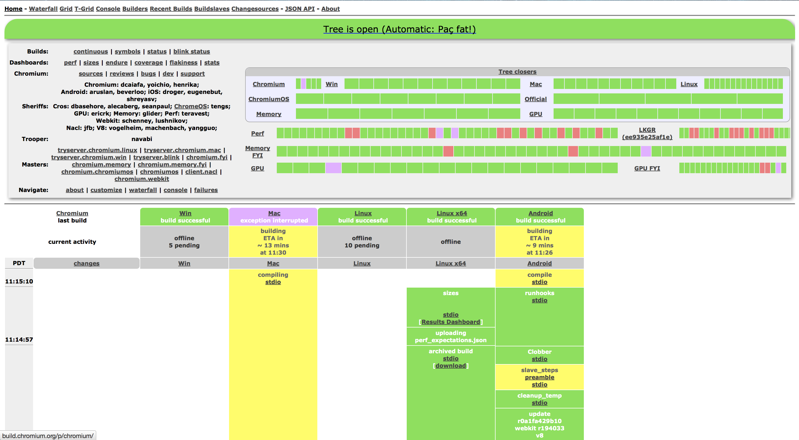

Continuous Integration
======================

Continuous Integration
----------------------

*The practice of merging all developer working copies with a shared mainline
several times a day*

Grady Booch

In Practice
-----------

* Automated testing of developer code
* Started as running all unit tests locally to ensure quality
* Uses a build server to **continuously** test & build
* May also build a package for deployment

Examples
--------

* Buildbot (Python)
* Drone (Uses Docker!)
* Jenkins
* Travis CI

Buildbot
--------

* Very arbitrary, typically lives in its own code base
* Jobs are defined via python
* So are notifications, UI, etc.
* People often say you can get a PhD in less time it takes
  to set up Buildbot
* Mostly uses polling (though it can accept pushes)

Buildbot
--------

Drone
-----

* Similar in setup to Travis CI (but you set it up, and it uses docker)
* You give it a docker container and something to run
* Registers with Github to push using webhooks
* Fairly alpha (being developed by a Startup)
* All the magic happens in a ``.drone.yml`` file in your main repo
* Code repo has a webhook to Drone instance.

Drone
-----

.. code-block:: yaml

    image: go1.3
    git:
    path: github.com/drone/drone
    env:
        - GOROOT=/usr/local/go
        - PATH=$PATH:$GOROOT/bin:$GOPATH/bin
    script:
        - sudo apt-get update 1> /dev/null 2> /dev/null
        - sudo apt-get -y install zip libsqlite3-dev sqlite3 rpm 1> /dev/null 2> /dev/null
        - gem install fpm
        - rbenv rehash
        - make deps
        - make test
        - make test_postgres
        - make test_mysql
        - make packages

Drone
-----

.. code-block:: yaml

    services:
        - postgres
        - mysql
    notify:
        email:
            recipients:
                - brad@drone.io
        gitter:
            room_id: $$GITTER_ROOM
            token: $$GITTER_KEY
            on_started: false
            on_success: true
            on_failure: true

Drone
-----

.. code-block:: yaml

    publish:
        s3:
            acl: public-read
            region: us-east-1
            bucket: downloads.drone.io
            access_key: $$AWS_KEY
            secret_key: $$AWS_SECRET
            source: packaging/output/
            target: $DRONE_BRANCH/
            recursive: true
            when:
            owner: drone

Jenkins
-------

* Easy to setup (java jar)
* Jobs mostly added via web UI
* Complex UI
* Massive plugin system
* Large number of users
* Harder to manage

Jenkins
-------

* Live demo

Travis CI
---------

* Strongly tied to github
* Runs on Travis CI servers
* Free for public github repos (no simultaneous builds unless you pay)
* Very easy to add jobs (stored in ``.travis.yml`` in repo)

Travis CI
---------

.. code-block:: yaml

    language: ruby
    sudo: false
    cache: bundler
    rvm:
        - 2.1
        - 2.2
    install:
        - bundle install --retry=3
    script:
        - bundle exec rubocop
        - bundle exec foodcritic -f any -t ~FC023 .

Travis CI
---------

`Travis CI Demo`_

.. _Travis CI Demo: https://travis-ci.org/osuosl-cookbooks/osl-haproxy

